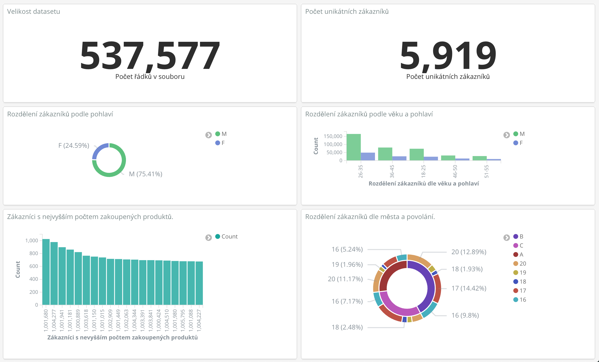

# Domácí úkol na BI-BIG
Vypracoval Matyáš Skalický 15.12.2018

# Rejstřík
- [Úvod](#Úvod)
- [Dataset](#dataset)
    + [Zdroj datasetu](#zdroj-datasetu)
      - [Dataset users.csv](#dataset-users.csv)
      - [Dataset products.csv](#dataset-products.csv)
      - [Dataset user_purchase.csv](#dataset-user-purchase.csv)
- [Spuštění databázového clusteru](#spuštění-databázového-clusteru)
  * [Spark](#spark)
    + [Build image pro spark](#build-image-pro-spark)
    + [Spuštění master a worker node](#spuštění-master-a-worker-node)
    + [spark-shell](#spark-shell)
      - [spuštění spark-shell](#spuštění-spark-shell)
    + [Připojení spark-shell na master](#připojení-spark-shell-na-master)
  * [HDFS kontejner](#hdfs-kontejner)
- [Import dat do databázového clusteru](#import-dat-do-databázového-clusteru)
- [Agregace](#agregace)
    + [dataset, který bude agregovat data z jednoho původního datasetu](#dataset,-který-bude-agregovat-data-z-jednoho-původního-datasetu)
    + [dataset, který bude agregovat data ze dvou původních datasetů najednou](#dataset,-který-bude-agregovat-data-ze-dvou-původních-datasetů-najednou)
    + [dataset, který bude agregovat data ze dvou datasetů najednou, z čehož jeden bude výsledkem předchozí agregace a uložit ho zpět do databáze/na file systém](#dataset,-který-bude-agregovat-data-ze-dvou-datasetů-najednou,-z-čehož-jeden-bude-výsledkem-předchozí-agregace-a-uložit-ho-zpět-do-databáze/na-file-systém)
- [Export dat ze spark clusteru](#export-dat-ze-spark-clusteru)
- [Vyhladávací index](#vyhladávací-index)
  * [Nahrání dat a tvorba indexu](#nahrání-dat-a-tvorba-indexu)
  * [Dotazy na index](#dotazy-na-index)
    + [Filtrování - vyhledání všech mužů](#filtrování---vyhledání-všech-mužů)
    + [Třídění - seřadit zákazníky podle útraty](#Třídění---seřadit-zákazníky-podle-útraty)
    + [Wildcard hledání - všichni zákazníci co přišli z Google](#Wildcard-hledání---všichni-zákazníci-co-přišli-z-Google)
  * [Dashboard](#dashboard)
- [Závěr](#závěr)

# Úvod
Cílem tohoto úkolu je zopakovat si postupy probrané na cvičení na vlastních datech.

# Dataset
Dataset obsahuje 550 000 záznamů z Black Friday z amerického obchodního řetězce. Obsahuje jak numerické, tak kategorické proměnné. Obsahuje chybějící hodnoty. Bylo dogenerován sloupec Refferal a upraveno Product_ID na numerickou hodnotu (odstraněním předpony P a úvodních nul). Úpravy datasetu jsou popsány v souboru  [DatasetTransform.ipynb](DatasetTransform.ipynb) který se nachází v příloze. Dataset byl pro potřeby úkolu rozdělen na 3 části.

### Zdroj datasetu:
[https://www.kaggle.com/mehdidag/black-friday](https://www.kaggle.com/mehdidag/black-friday)

#### Dataset users.csv
|   User_ID | Gender   | Age   |   Occupation | City_Category   | Stay_In_Current_City_Years   |   Marital_Status | Refferal            |
|----------:|:---------|:------|-------------:|:----------------|:-----------------------------|-----------------:|:--------------------|
|   1000001 | F        | 0-17  |           10 | A               | 2                            |                0 | www.baidu.com       |
|   1000001 | F        | 0-17  |           10 | A               | 2                            |                0 | www.samsung.com     |
|   1000001 | F        | 0-17  |           10 | A               | 2                            |                0 | www.google.com.ar   |
|   1000001 | F        | 0-17  |           10 | A               | 2                            |                0 | www.google.ca       |
|   1000002 | M        | 55+   |           16 | C               | 4+                           |                0 | www.accuweather.com |

```
RangeIndex: 537577 entries, 0 to 537576
Data columns (total 8 columns):
User_ID                       537577 int64 
    - Unikátní identifikátor uživatele.
Gender                        537577 object 
    - Pohlaví zákazníka (M/F).
Age                           537577 object 
    - Věková skupina zákazníka.
Occupation                    537577 int64 
    - Kategorie dle typu zaměstnání (maskovaná, číslo).
City_Category                 537577 object 
    - Kategorie města (maskovaná - hodnoty A, B, C).
Stay_In_Current_City_Years    537577 object 
    - Délka pobytu v současném městě v letech.
Marital_Status                537577 int64 
    - Manželský status (1=ženatý, 0=jinak).
Refferal                      537577 object 
    - Stránka, odkud uživatel přišel, když se registroval (náhodně generováno).
memory usage: 32.8+ MB
```

#### Dataset products.csv
|   User_ID |   Product_ID |   Product_Category_1 |   Product_Category_2 |   Product_Category_3 |
|----------:|-------------:|---------------------:|---------------------:|---------------------:|
|     1e+06 |        69042 |                    3 |                  nan |                  nan |
|     1e+06 |       248942 |                    1 |                    6 |                   14 |
|     1e+06 |        87842 |                   12 |                  nan |                  nan |
|     1e+06 |        85442 |                   12 |                   14 |                  nan |
|     1e+06 |       285442 |                    8 |                  nan |                  nan |

```
RangeIndex: 537577 entries, 0 to 537576
Data columns (total 5 columns):
User_ID               537577 int64 
    - Unikátní identifikátor uživatele.
Product_ID            537577 int64 
    - Unikátní identifikátor produktu.
Product_Category_1    537577 float64 
    - Primární kategorie produktu. (maskovaná, číslo)
Product_Category_2    370591 float64 
    - Sekundární kategorie produktu. (maskovaná, číslo)
Product_Category_3    164278 float64 
    - Tercérní kategorie produktu. (maskovaná, číslo)
memory usage: 20.5 MB
```

#### Dataset user_purchase.csv
|   User_ID |   Purchase |
|----------:|-----------:|
|     1e+06 |       8370 |
|     1e+06 |      15200 |
|     1e+06 |       1422 |
|     1e+06 |       1057 |
|     1e+06 |       7969 |

```
RangeIndex: 537577 entries, 0 to 537576
Data columns (total 2 columns):
User_ID     537577 non-null int64
    - Unikátní identifikátor uživatele.
Purchase    537577 non-null int64
    - Předpokládám že kumulativní suma částky utracené uživatelem v obchodě. Dataset neobsahuje informace o měně. Domnívám se, že částky jsou v centech (tedy v dolarech * 100) jelikož se jedná o velmi vysoké částky.
memory usage: 8.2 MB
```

# Spuštění databázového clusteru
Následující postup vychází z [návodu prezentovaného na 5. cvičení](https://courses.fit.cvut.cz/BI-BIG/tutorials/05/index.html). Postup vyžaduje nainstalovaný a plně funkční [docker-compose](https://docs.docker.com/compose/). 

## Spark
### Build image pro spark
Otevřeme terminál ve složce spark. Bude vytvořen image *spark* který bude využit dle parametrů při spuštění jak pro worker, tak pro master node.

```bash
docker build -f spark.df -t spark .
```

### Spuštění master a worker node
```bash
docker-compose up
```

### spark-shell
#### spuštění spark-shell
Následující příkaz spustí kontejner s přístupem do bashe na popředí.
```bash
docker run -it -p 8088:8088 -p 8042:8042 -p 4041:4040 --name driver -h driver spark:latest bash
```

### Připojení spark-shell na master
V běžícím bashi kontejneru se připojíme na mster node spark clusteru. 
```bash
spark-shell --master spark://<IP adresa mastera>:7077
```

## HDFS kontejner
Pro spuštění kontejneru s Hadoop HDFS použijeme následující příkaz:
```bash
docker run --name hadoop -t -i sequenceiq/hadoop-docker /etc/bootstrap.sh -bash
```

Pro zjednodušení práce si přidáme do cesty image odkaz na hadoop.
```bash
export PATH=$PATH:/usr/local/hadoop/bin/
```

# Import dat do databázového clusteru
Vytvoříme složku *data* v rootu hadoop image a v rootu HDFS filesystému.
```bash
mkdir /data
hdfs dfs -mkdir /data
```

Kopie dat do kontejneru na kterém běží HFDS.
```bash
docker cp data/products.csv hadoop:/data/products.csv
docker cp data/user_purchase.csv hadoop:/data/user_purchase.csv
docker cp data/users.csv hadoop:/data/users.csv
```

Vložení dat z filesystému image do HDFS.
```bash
hdfs dfs -put /data/products.csv /data/products.csv
hdfs dfs -put /data/user_purchase.csv /data/user_purchase.csv
hdfs dfs -put /data/users.csv /data/users.csv
```

Načtení csv souboru z HDFS do sparku
```scala
val users = spark.sqlContext.read.format("csv").option("header", "true").option("inferSchema", "true").load("hdfs://172.17.0.5:9000/data/users.csv")
val user_purchase = spark.sqlContext.read.format("csv").option("header", "true").option("inferSchema", "true").load("hdfs://172.17.0.5:9000/data/user_purchase.csv")
val products = spark.sqlContext.read.format("csv").option("header", "true").option("inferSchema", "true").load("hdfs://172.17.0.5:9000/data/products.csv")
```

# Agregace
### dataset, který bude agregovat data z jednoho původního datasetu
Zjistíme, kolik maximálně uživatel utratil. Vzhledem k tomu, že přepokládám, že se jedná o kumulativní sumu tedy i kolik celkem v obchodě utratil.
```scala
// Zjistíme maximální hodnoty sloupce Purchase
val user_purchase_max = user_purchase.groupBy("User_ID").max("Purchase")
// Zobrazíme výsledek
user_purchase_max.show()
```

### dataset, který bude agregovat data ze dvou původních datasetů najednou
Zjistíme, kteří zákazníci si koupili nejméně produktů
```scala
// Registrace Dataframe jako SQL tabulek
users.registerTempTable("users")
products.registerTempTable("products")

// SQL dotaz
val users_order_count = spark.sqlContext.sql("SELECT User_ID, first_value(Gender) as Gender, first_value(Age) as Age, first_value(Occupation) as Occupation, first_value(City_Category) as City_Category, first_value(Stay_In_Current_City_Years) as Stay_In_Current_City_Years, first_value(Marital_Status) as Marital_Status, first_value(Refferal) as Refferal, COUNT(Product_ID) as Product_Count FROM users u FULL JOIN products p USING(User_ID) GROUP BY User_ID ORDER BY Product_Count ASC")

// Zobrazíme si výsledek. Volání provede dotaz.
users_order_count.show()
```


### dataset, který bude agregovat data ze dvou datasetů najednou, z čehož jeden bude výsledkem předchozí agregace a uložit ho zpět do databáze/na filesystém
```scala
// Registrace dataframu na SQL tabulku
user_purchase_max.withColumnRenamed("max(Purchase)", "Purchase").registerTempTable("user_purchase_max").
users_order_count.registerTempTable("users_order_count")

// Dotaz
val user_average_purchase_amount = spark.sqlContext.sql("SELECT User_ID, Purchase / Product_Count as average_purchase FROM users_order_count u JOIN user_purchase_max USING (User_ID) ORDER BY average_purchase DESC")

// Zobrazíme výsledek
user_average_purchase_amount.show()
```

# Export dat ze spark clusteru
Na HDFS se vytvoří složka /data/users_order_count s výsledným csv.
```scala
users_order_count.coalesce(1).write.format("com.databricks.spark.csv").option("header","true").save("hdfs://172.17.0.5:9000/data/users_order_count")
```

Kopie dat z HDFS do filesystému kontejneru na kterém běží HDFS.
```bash
hdfs dfs -get /data/users_order_count /data/users_order_count
```

Kopie dat z filesystému kontejneru do filesystému počítače.
```bash
docker cp hadoop:/data/users_order_count .
```

# Vyhladávací index
## Nahrání dat a tvorba indexu
Použijeme kontejner s technologií ElasticSearch pro indexaci csv souboru. Zároveň spustíme i kontejner Kibana, který slouží pro vizualizaci a dotazování nad daty. Data do ElasticSearch dostaneme za pomocí docker kontejneru LogStash. [Postup vychází ze cvičení číslo 9](https://courses.fit.cvut.cz/BI-BIG/tutorials/09/index.html).

Jdeme do složky logstash. Kontejnery spustíme na pozadí s použitím příkazu:
```bash
docker-compose up -d
```

Data se načtou dle definice konfigurace v souboru *logstash.conf*:
```json
input {
	file {
		path => "/datasets/BlackFridayEdit.csv"
		start_position => "beginning"
	}
}

filter {
	csv {
		separator => ","
		columns => ["User_ID", "Product_ID", "Gender", "Age", "Occupation", "City_Category", "Stay_In_Current_City_Years", "Marital_Status", "Product_Category_1", "Product_Category_2", "Product_Category_3", "Purchase", "Refferal"]
	}
	mutate {convert => ["User_ID", "integer"]}
	mutate {convert => ["Product_ID", "integer"]}
	mutate {convert => ["Occupation", "integer"]}
	mutate {convert => ["Product_Category_1", "integer"]}
	mutate {convert => ["Product_Category_2", "integer"]}
	mutate {convert => ["Product_Category_3", "integer"]}
	mutate {convert => ["Purchase", "integer"]}
	}

output {
	elasticsearch {
		hosts => "http://elasticsearch:9200"
		index => "blackfriday"
	}
}

```

Uživatelské rozhraní Kibana je na adrese: [http://127.0.0.1:5601](http://127.0.0.1:5601). Pro vytvoření indexu zvolíme *Management -> Index Patterns* a do pole "Index pattern" okopírujeme název indexu, tedy "blackfriday". Následně klikneme next a v time filter zvolíme možnost "I don't want to use Time Filter" jelikož náš dataset neobsahuje časové značky. Klikneme na Create index pattern a index je tak vytvořen.

## Dotazy na index
Dotazy v Kibaně lze provádět v záložce *Discover*. Konzole se nachází na *Dev Tools -> Console*. 

### Filtrování - vyhledání všech mužů:
Dev Tools:
```json
GET /blackfriday/doc/_search
{
    "query": {
        "match": {
        "Gender": "M"
        } 
    }
}
 ```

 Kibana: 
 ```Gender:M```

### Třídění - seřadit zákazníky podle útraty
Dev Tools:
```json
GET /blackfriday/doc/_search
{
    "sort": {
        "Purchase": {
            "order" : "desc"
        }
    }
}
```

### Wildcard hledání - všichni zákazníci co přišli z Google
Dev Tools:
```json
GET /blackfriday/doc/_search
{
    "query": {
        "wildcard": {
            "Refferal": "www.google.*"
        } 
    }
}
```

Kibana:
``` Refferal:www.google.* ```

## Dashboard
Dashboard je uložen ve formátu JSON v souboru dashboard_blackfriday.json ve složce logstash. Náhled vytvořeného dashboardu:


# Závěr
Vyzkoušel jsem si vytvořit vlastní Spark cluster s Hadoop HDFS úložištěm a následně ve spark-console udělat pár jednoduchých transformací. Dataset jsem taktéž importoval přes LogStash do ElasticSearch, vytvořil pár vyhledávacích dotazů a v Kibaně následně připravil dashboard s vizualizacemi. Vypracování úkolu mě moc nebavilo, protože jsem prováděl velmi podobné postupy jako na cvičení a v UseCasech. I tak mi tato semestrální práce zabrala větší množství času, než by mi připadalo užitečné. Mám pocit, že celá práce byla spíš než o big data o psaní dokumentace a o vymýšlení SQL dotazů. Radši bych svůj čas strávil děláním něčeho smysluplnějšího.
